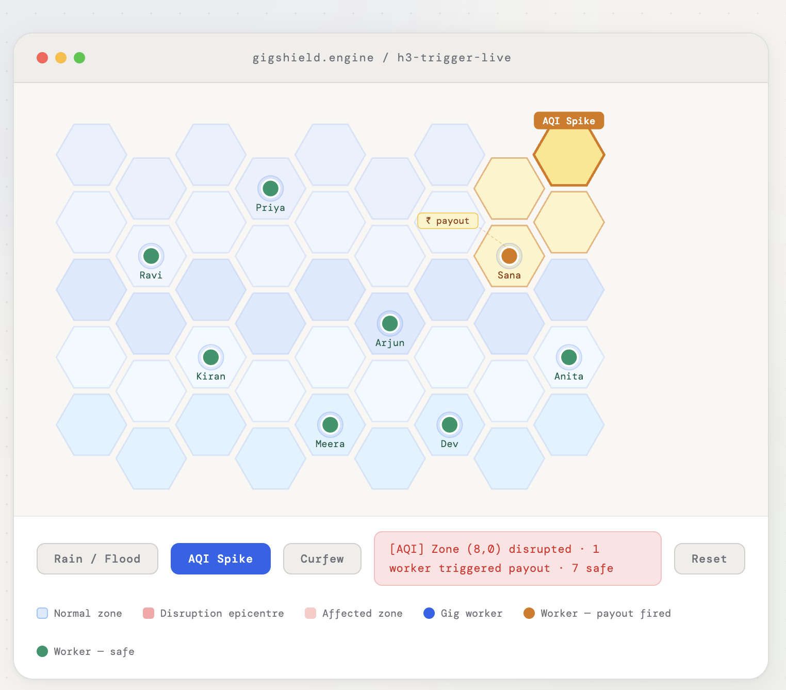
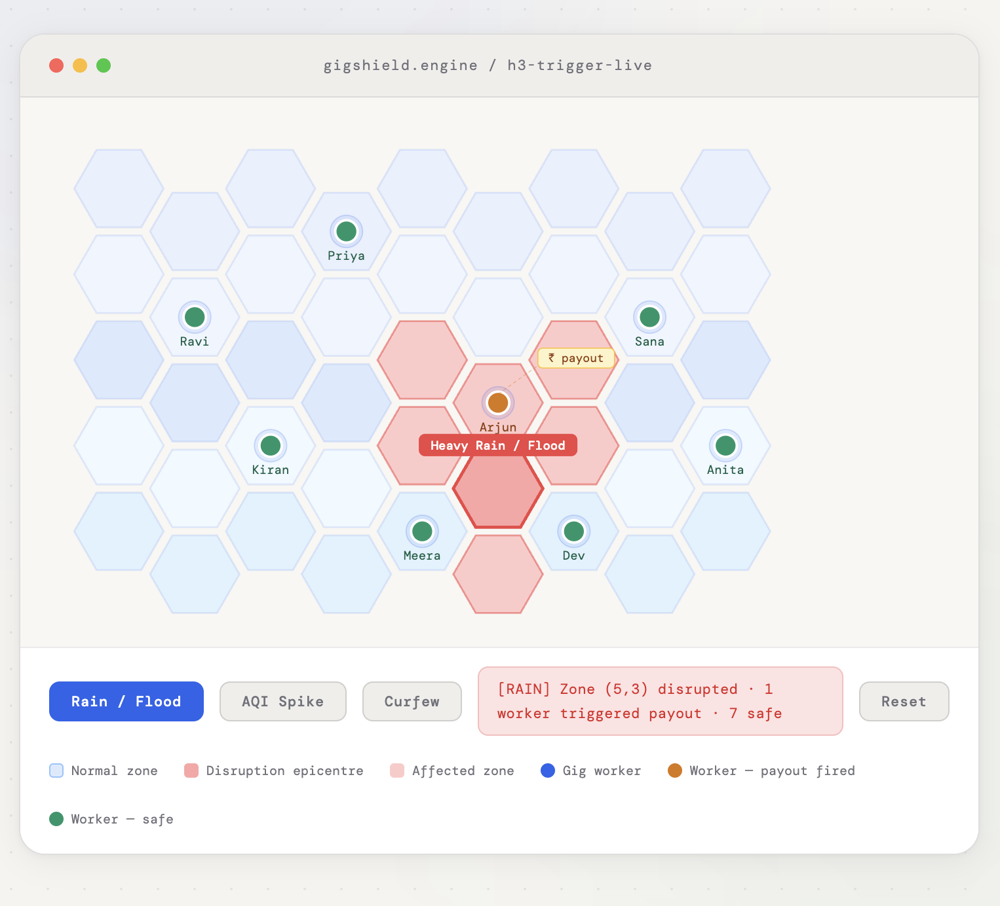
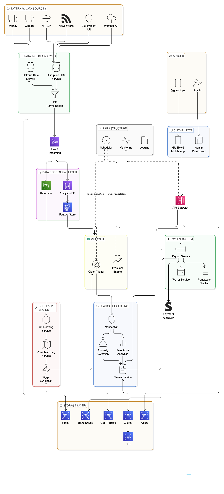
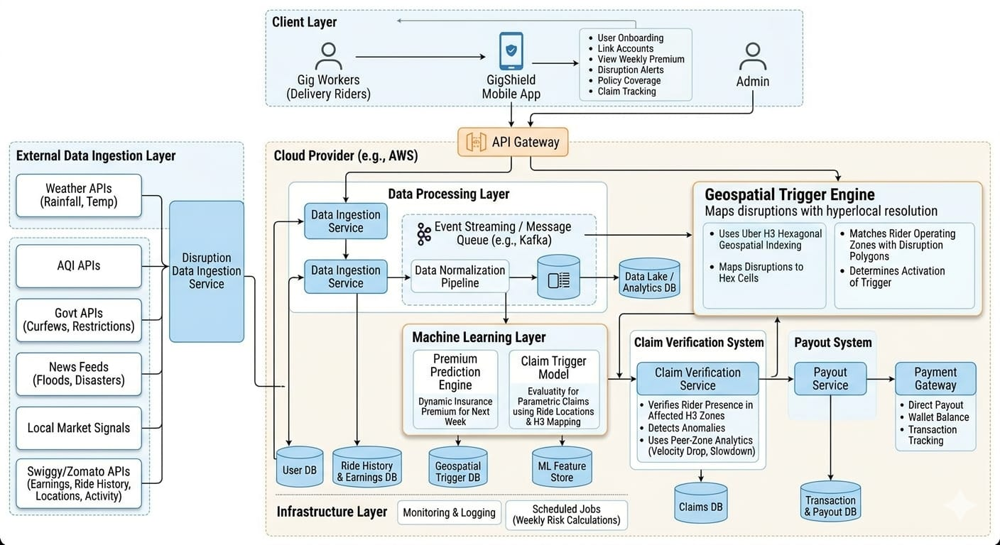

<p align="center">
  <h1 align="center">🛡️ GigShield AI</h1>
  <p align="center"><b>Protecting Gig Workers' Income, One Hex at a Time</b></p>
  <p align="center">
    
    
    
    
  </p>
</p>

---

## 📌 What is GigShield AI?

**GigShield AI** is an AI-powered **parametric income protection platform** built exclusively
for gig delivery workers on platforms like **Swiggy** and **Zomato**.

Gig workers have zero control over external disruptions — yet they bear **100% of the
financial consequences**, often losing **20–30% of their weekly earnings** due to events like:

| Disruption | Impact |
|---|---|
| 🌧️ Heavy rain & floods | Delivery zones become unreachable |
| 🌫️ Severe AQI spikes | Workers unable to operate safely |
| 🚧 Traffic & road blockages | Routes cut off, deliveries delayed |
| 🚨 Curfews, strikes & shutdowns | Entire zones go dark overnight |

> **GigShield AI flips this equation** — disruptions are detected in real time, worker
> impact is verified at zone level, and compensation is triggered automatically.
> No paperwork. No waiting. No disputes.

---

## 🧠 Core Innovation

GigShield AI is built on three proprietary technologies that together form a system
no traditional insurer can replicate.

---

### 🔷 H3 Geospatial Intelligence

Every city is divided into a precise grid of **hexagonal micro-zones** using
[Uber's H3 spatial indexing system](https://h3geo.org/).

All incoming signals — from weather feeds, government APIs, delivery platforms,
and worker GPS — are mapped onto the **exact same hexagonal grid**. This means
a disruption in hex cell `8a2a1072b59ffff` can be instantly cross-referenced
against which workers were active in that cell at that moment.
```
City Grid (H3 Hexagons)
┌──────────────────────────────────────┐
│  🔵 Normal zone   🔴 Disrupted zone  │
│                                      │
│   ⬡ ⬡ ⬡ 🔴 🔴 ⬡ ⬡                  │
│  ⬡ ⬡ 🔴 🔴 🔴 🔴 ⬡                  │
│   ⬡ ⬡ 🔴[👷]🔴 ⬡ ⬡   ← Worker hit  │
│  ⬡ ⬡ ⬡ 🔴 🔴 ⬡ ⬡                   │
│   ⬡ ⬡ ⬡ ⬡ ⬡ ⬡ ⬡                   │
└──────────────────────────────────────┘
```

**Signals mapped into H3:**
- 📍 Worker GPS location (live)
- ⛈️ Weather & AQI readings
- 🚦 Traffic & road blockage data
- 📦 Delivery activity & completion rates
- 🏛️ Government zone restrictions

---

### 🔷 H3 Trigger Engine — Visual Preview


<p align="center">
  
</p>

<p align="center">
  <b>Disruption triggered — affected workers flagged, payouts fired automatically</b>
</p>

<p align="center">
  
</p>

---

### 🔷 Parametric Trigger Model

GigShield AI does **not** work like traditional insurance where a worker files a
claim and waits weeks for approval. Instead, payouts fire **automatically** the
moment two conditions are simultaneously true:
```
Trigger condition:

  disruption_detected_in_zone == TRUE
              AND
  worker_active_in_zone == TRUE
              ↓
  ✅ Payout triggered automatically
```

No claim forms. No phone calls. No adjuster. The system fires the moment the
parameters are met — exactly like a parametric insurance model should.

---

### 🔷 AI Verification Layer

Before any payout clears, a **5-signal AI verification check** runs in parallel
to ensure precision and prevent fraud:

| Signal | What it checks |
|---|---|
| ✅ Active status | Was the worker logged in and working during the disruption? |
| ✅ H3 zone presence | Does GPS confirm the worker was inside the affected hexagon? |
| ✅ Route impact score | Was the worker's delivery route demonstrably disrupted? |
| ✅ Activity drop | Did delivery completion rate fall below the threshold? |
| ✅ Peer-zone anomaly | Do other workers in the same hex corroborate the disruption? |

> All five signals must agree. This eliminates false claims, prevents
> over-compensation, and ensures every payout is precise and defensible.

---

## ⚡ How It Works — End to End
```
Step 1 — Signal ingestion
   Weather APIs + AQI + Govt feeds + News + Platform APIs
                        ↓
Step 2 — H3 mapping
   Every signal is plotted into the hexagonal city grid
                        ↓
Step 3 — Zone overlap detection
   Worker GPS zone cross-referenced with disruption zone
                        ↓
Step 4 — AI verification (5-point check)
   Active status · H3 presence · Route impact · Activity drop · Peer anomaly
                        ↓
Step 5 — Parametric trigger fires
   Payout approved automatically — no manual review
                        ↓
Step 6 — Disbursement
   Wallet credit or direct bank transfer — within minutes
```
## ⚡ Workflow Diagram 
<p align="center">
  
</p>
---

## 💡 Why GigShield AI Wins

| Traditional Insurance | GigShield AI |
|---|---|
| City-level risk assessment | Hex-cell-level precision |
| Manual claim filing | Zero-touch automatic trigger |
| Days or weeks to payout | Minutes to payout |
| Opaque approval process | Fully auditable AI decision |
| One-size premium | Dynamic AI-priced weekly premium |
| Reactive to claims | Proactive disruption detection |

---

## 👷 Who It's Built For

GigShield AI is designed for the **last-mile delivery worker** — someone who:

- Earns per delivery, with no fixed salary or safety net
- Works through rain, smoke, and road chaos because stopping means zero income
- Has no access to traditional insurance products
- Needs protection that is **instant, fair, and automatic**

> *"I lost ₹1,800 last Tuesday because of the waterlogging near Kurla.
> No one compensated me. It just disappeared."*
> — Delivery partner, Mumbai

GigShield AI exists so that Tuesday never goes uncompensated again.

---

# 🏗️ System Architecture

> A microservices-based insurance platform protecting gig workers from income disruption.

GigShield is built across **9 layered microservices**, each responsible for a distinct domain — from real-time signal ingestion to hyper-local geospatial matching, ML-driven pricing, and instant payouts.

<p align="center">
  
</p>

---

## 1️⃣ Client Layer — GigShield Mobile App

The only touchpoint gig workers interact with. Built for delivery workers on platforms like Swiggy and Zomato.

**Features:**
- User onboarding & authentication
- Link Swiggy / Zomato accounts
- View weekly premium & coverage plans
- Receive real-time disruption alerts
- Track claims & payout status

---

## 2️⃣ External Data Ingestion Layer

Continuously pulls real-world disruption signals from multiple sources.

| Source | Data Collected |
|---|---|
| 🌦️ Weather APIs | Rain, storms, extreme weather |
| 🌫️ AQI APIs | Air quality, pollution levels |
| 🏛️ Government APIs | Curfews, restrictions, lockdowns |
| 📰 News feeds | Floods, disasters, civic events |
| 📈 Market signals | Demand disruptions |
| 🚴 Delivery platform APIs | Earnings, GPS, ride history, activity |

---

## 3️⃣ Data Processing Layer

Transforms raw signals into clean, normalised, query-ready streams.

**Components:**
- **Ingestion service** — receives all incoming data feeds
- **Normalisation pipeline** — brings every signal to a common schema
- **Event streaming (Message Queue)** — decouples producers from consumers
- **Data lake / analytics DB** — stores everything for analytics and model training

---

## 4️⃣ Geospatial Trigger Engine (H3-Based)

The core differentiator. Uses Uber's H3 hexagonal grid to detect disruptions at a hyper-local level.

**Capabilities:**
- Maps all data signals into H3 hexagonal cells
- Matches worker GPS zones against disruption zones
- Activates payout trigger if zone overlap is confirmed
- Operates at street-level granularity — not just city-wide

---

## 5️⃣ Machine Learning Layer

Two purpose-built models serving distinct roles.

### 🤖 A. Premium Prediction Engine
- Forecasts disruption probability for the coming week
- Computes a dynamic, risk-adjusted weekly premium per worker

### 🤖 B. Claim Trigger Model
- Evaluates whether a worker qualifies for a payout
- Inputs: GPS location data, delivery activity, H3 zone match
- Outputs: eligibility decision with confidence score

---

## 6️⃣ Claim Verification System

Multi-signal anti-fraud validation. All five checks must pass before a claim is approved.

| Check | Description |
|---|---|
| ✅ Active during disruption | Worker was logged in and working |
| ✅ Present in H3 zone | GPS confirms presence in affected hexagon |
| ✅ Route disruption impact | Delivery route was demonstrably affected |
| ✅ Activity drop detection | Measurable fall in delivery completion rate |
| ✅ Peer-zone anomaly | Corroborated by patterns from workers in same zone |

---

## 7️⃣ Payout System

Fast, auditable disbursement to gig workers once a claim is verified.

**Features:**
- Payment gateway integration
- Wallet-based payouts
- Direct bank transfers
- Full transaction ledger for compliance & auditability

---

## 8️⃣ Storage Systems

Purpose-isolated databases — each service only touches its own data domain.

| Store | Purpose |
|---|---|
| 👤 User database | Identity, preferences, onboarding |
| 🚴 Ride & earnings DB | Historical delivery & income data |
| 🗺️ Geo-trigger DB | H3 zone events and disruption logs |
| 🧠 ML feature store | Training features for both ML models |
| 📋 Claims database | All claim events and verification results |
| 💸 Transactions DB | Payout records and financial ledger |

---

## 9️⃣ Infrastructure Layer

Cloud-native, event-driven, and fully observable.

**Components:**
- ☁️ **Cloud deployment** — auto-scaling microservices
- 🔀 **API Gateway** — routing, rate limiting, auth middleware
- 📨 **Message queues** — async processing between services
- ⏰ **Scheduled jobs** — weekly premium recalculation per worker
- 📊 **Monitoring & logging** — full observability across all services

---

## 🔄 Data Flow Summary
```
Mobile App
    ↓
External Signals (Weather, AQI, Govt, News, Platform APIs)
    ↓
Data Processing (Ingest → Normalise → Stream → Store)
    ↓
H3 Geospatial Engine (Zone match → Trigger)
    ↓
ML Layer (Premium Pricing + Claim Evaluation)
    ↓
Claim Verification (5-point fraud check)
    ↓
Payout System (Wallet / Bank Transfer)
    ↓
Storage (Isolated DBs per domain)
    ↓
Infrastructure (Cloud + Gateway + Queues + Monitoring)
    ↓ (feedback)
Mobile App ← Payout status & claim updates
```

---

## 🧱 Tech Stack Highlights

| Concern | Approach |
|---|---|
| Geospatial indexing | Uber H3 hexagonal grid |
| ML pricing | Disruption probability forecasting |
| Fraud prevention | 5-signal claim verification |
| Data pipeline | Event streaming via message queue |
| Storage | Domain-isolated microservice DBs |
| Deployment | Cloud-native, auto-scaling |

---

## 🔄 System Workflow — End to End

> From the moment a worker signs up to the moment a payout lands in their
> wallet, here is exactly what GigShield AI does — and how.

---

### Step 1 — Worker Onboarding

- Registers with their name, phone number, and city
- Links their Swiggy or Zomato account via OAuth
- Grants GPS permission for zone-level tracking
- Identity is verified and a worker profile is created in the system
```
Worker → Mobile App → OAuth Link → Platform Account → Profile Created
```

---

### Step 2 — Weekly Premium Calculation

- Historical earnings, zone, delivery hours, and disruption frequency are analysed
- A dynamic weekly premium is computed — workers in high-risk zones pay slightly more
- Worker selects a coverage plan (basic / standard / full) via the app
- Premium is deducted from the linked payment method or wallet
```
AI Risk Model → Disruption Probability Score → Premium Amount → Worker Selects Plan
```

---

### Step 3 — Continuous Data Ingestion

The platform runs 24/7, pulling live signals from multiple external sources.

| Signal | Source |
|---|---|
| 🌧️ Weather & AQI | Weather APIs, pollution monitoring feeds |
| 🚦 Traffic conditions | Maps APIs, road closure databases |
| 📦 Worker activity | Delivery platform APIs (earnings, GPS, ride status) |
| 🏛️ Civic disruptions | Government APIs, verified news feeds |

All signals are normalised and mapped into the **H3 hexagonal city grid** in real time.

---

### Step 4 — Disruption Detection

- Incoming signals are overlaid onto H3 hexagonal cells
- If a disruption threshold is crossed in any cell (e.g. rainfall > 40mm/hr, AQI > 300), that cell is flagged as **disrupted**
- Worker GPS traces are matched against flagged cells
- If a worker's active zone overlaps with a disrupted zone → **trigger condition met**
```
Signal Feed → H3 Mapping → Zone Disruption Flagged → Worker Zone Overlap → Trigger Fired
```

---

### Step 5 — Impact Verification

Before any claim is created, the AI verification layer runs a **5-point check**
to confirm the worker was genuinely impacted.
```
┌─────────────────────────────────────────────────────┐
│            Impact Verification Checks               │
├─────────────────────────────────────────────────────┤
│  ✅  Worker was active during the disruption window  │
│  ✅  GPS confirms presence inside affected H3 zone   │
│  ✅  Delivery route was demonstrably disrupted       │
│  ✅  Activity drop detected vs. baseline             │
│  ✅  Peer-zone anomaly corroborates the event        │
└─────────────────────────────────────────────────────┘
```

All five checks must pass. Any mismatch flags the claim for review.

---

### Step 6 — Claim Decision

- Confidence score is generated from all five signals combined
- If score clears the threshold → claim is **approved automatically**
- If score is borderline → claim is **flagged for manual review**
- If signals contradict → claim is **rejected with reason logged**
```
Verification Output → ML Confidence Score → Approve / Review / Reject
```

---

### Step 7 — Claim Creation

- Claim ID is created and linked to the worker's profile
- Disruption event, zone, timestamp, and payout amount are recorded
- Worker receives an in-app notification: *"Your claim has been approved"*
- Full claim details are available in the app dashboard
```
Decision: Approved → Claim Record Generated → Worker Notified → Logged to Claims DB
```

---

### Step 8 — Payout Execution

- Payout amount is calculated based on earnings baseline and coverage plan
- Transferred to worker's in-app wallet or directly to their bank account
- Transaction is recorded in the ledger for full auditability
- Worker receives a payout confirmation notification
```
Claim Approved → Payout Calculated → Wallet / Bank Transfer → Transaction Logged
```

---

### Step 9 — Dashboard Update

- Payout amount and claim status are displayed
- Disruption event details are shown (zone, time, cause)
- Earnings protection summary is updated for the week
- Historical claim and payout records remain accessible at any time
```
Payout Executed → Dashboard Synced → Worker Views Status → Record Stored
```

---

### 🔁 Complete Flow at a Glance
```
  👷 Worker Onboards
        ↓
  🧠 AI Calculates Weekly Premium
        ↓
  📡 Live Data Ingested (Weather · AQI · Traffic · Activity)
        ↓
  🔷 H3 Engine Detects Disrupted Zone
        ↓
  📍 Worker GPS Matched to Disrupted Hex
        ↓
  ✅ 5-Point AI Verification Runs
        ↓
  ⚖️  ML Claim Decision (Approve / Review / Reject)
        ↓
  📋 Claim Auto-Created
        ↓
  💸 Payout Executed (Wallet / Bank)
        ↓
  📱 Worker Dashboard Updated
```

---

## 🎯 Why GigShield AI Stands Out

GigShield AI is not another insurance product with a digital front end.
It is a ground-up rethink of how protection should work for the gig economy —
precise, automated, fair, and built entirely around the worker.

| Advantage | What it means in practice |
|---|---|
| ✅ Hyper-local H3 precision | Payouts are triggered at street-block level — not city-wide guesses |
| ✅ AI-driven fairness | Every premium and every payout is computed by data, not discretion |
| ✅ Fraud-resistant by design | 5-signal verification means no single data point can game the system |
| ✅ Fully automated claims | Zero forms, zero calls, zero waiting — the system acts before the worker even asks |
| ✅ Worker-centric design | Built for people who earn per delivery, not per month |
| ✅ Scalable for the gig economy | Architected to expand across cities, platforms, and disruption types |

---

## 🌍 Impact

GigShield AI is more than a product — it is infrastructure for a fairer gig economy.

### 🛡️ Financial safety net for gig workers
For the first time, delivery workers have a reliable income floor. A bad weather
week no longer means a bad earnings week. Workers can take to the road knowing
that if the city shuts down, their income does not.

### ⚖️ Fair compensation model
Payouts are calculated against each worker's personal earnings baseline — not
a flat rate. A worker who earns ₹8,000 a week is compensated proportionally
to their actual loss, not handed a token amount that ignores their real impact.

### 📈 Scalable insurance innovation
The H3 + parametric model is city-agnostic and platform-agnostic. What works
in Mumbai works in Bengaluru, Delhi, and Hyderabad — and the same architecture
extends to auto-rickshaw drivers, hyperlocal couriers, and any gig category
where income is disruption-sensitive.

### 🤝 Trust between workers and platforms
When workers know they are protected, they stay on the platform longer, work
more confidently, and churn less. GigShield AI turns income protection into
a retention and loyalty tool for the platforms themselves.

---

## 🔮 Future Scope

GigShield AI is built to grow. The foundation is live — what follows is the
roadmap for what comes next.

---

### 🎛️ Personalised Coverage Builder

> *Choose exactly what you need. Pay only for what you pick.*

Today, workers choose from preset plans. Tomorrow, they will build their own.

The **Coverage Builder** will allow every worker to configure their protection
from the ground up — selecting the disruption types they want covered, setting
their own payout thresholds, and locking in the premium that fits their weekly budget.
```
Worker opens Coverage Builder
        ↓
Selects disruption types to cover:
  ☑️  Heavy rain & floods
  ☑️  AQI spikes
  ☐  Traffic blockages       ← opted out
  ☑️  Curfews & zone shutdowns
        ↓
Sets payout threshold:
  Earnings drop > 30% → trigger payout
        ↓
AI computes personalised premium
        ↓
Worker confirms & activates plan
```

**What this unlocks:**
- Workers in coastal cities can prioritise flood coverage
- Workers in industrial zones can weight AQI protection higher
- Part-time workers can select lighter, lower-cost plans
- Every plan is unique — priced to the individual, not the category

---

### 🏆 Rewards Wallet

> *The safer you work, the more you earn back.*

GigShield AI will introduce a **Rewards Wallet** — a loyalty layer that
turns consistent, disruption-free weeks into tangible financial benefits.

| Reward Trigger | What the worker earns |
|---|---|
| 🟢 No claim for 4 consecutive weeks | Cashback on next premium |
| ⭐ High delivery consistency score | Bonus wallet credits |
| 🔰 Early adopter milestone | One-time premium discount |
| 📅 12-month active membership | Annual loyalty bonus payout |
| 🤝 Referral — new worker joins | Referral credit added to wallet |

**Wallet credits can be used to:**
- Offset the next week's premium
- Boost coverage tier for a single high-risk week
- Withdraw as cash once a minimum balance is reached

> The Rewards Wallet transforms GigShield AI from a safety net into
> an active financial tool — one that rewards workers for consistency
> and keeps them engaged beyond the claim moment.

---

### 🔭 What Else Is Coming

| Feature | Description |
|---|---|
| 🏙️ Multi-city expansion | Roll out H3 grid and trigger engine to Bengaluru, Delhi, Hyderabad, Chennai |
| 🚗 Multi-platform support | Extend beyond Swiggy & Zomato to Blinkit, Zepto, Dunzo, Porter |
| 📊 Worker earnings dashboard | Weekly income analytics, disruption history, and trend insights |
| 🤖 Conversational claims assistant | WhatsApp / in-app AI assistant to explain claims in local language |
| 🏦 Credit score integration | Use GigShield payment history to build a gig worker credit profile |
| 🌐 Open API for platforms | Let Swiggy and Zomato embed GigShield protection natively in their apps |

---

> GigShield AI starts with income protection.
> It ends with financial inclusion for every gig worker in India.

---

<p align="center">
  Built with ❤️ for the invisible workforce powering urban delivery
</p>
